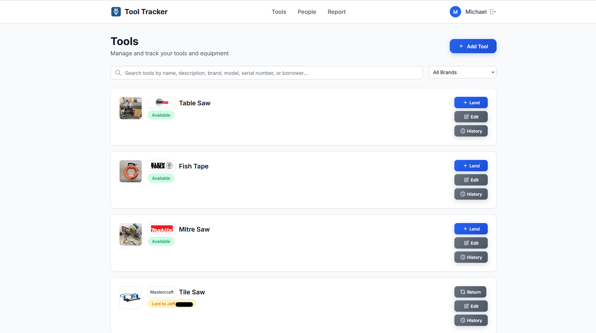

# Tool Tracker

*Neither a borrower, nor a lender be...* - Some smart guy

A modern web application for tracking tools and equipment lending.




## Features

- **Tool Management**: Add, edit, and track tools with descriptions, values, and images
- **Lending System**: Lend tools to people and track returns
- **People Management**: Maintain a database of people who borrow tools
- **Reporting**: View current loans and lending history
- **Brand Logo Badges**: Professional manufacturer logos instead of plain text badges
- **Responsive Design**: Works seamlessly on desktop and mobile devices
- **Multi-User Authentication**: OIDC-based authentication with support for multiple users

## Getting Started

### Docker Compose

1. **Clone the repository:**
   ```bash
   git clone https://github.com/d-kholin/tooltracker.git
   cd tooltracker
   ```
2. **Setup your .env file**
```bash
   cp env.example .env
   # Edit .env with your OIDC provider details
```

Add in your OIDC values (Yes, this only works with SSO. Don't use local auth!)

3. **Run with Docker Compose:**
   ```bash
   docker-compose up -d
   ```

4. **Access the application:**
   Open your browser to `http://localhost:5000`


## A note from the Dev
👋 Hi! Ok, the above is a bit of a lie, I'm not much of a developer. Heck, I'm a manager who can't stop tinkering, and this is my latest project. 

#### How did I come up with this? 
Well, the idea was simple, there's a guy with a number of my tools, and by now I've forgotten what I lent him. If only I'd tracked that somewhere....
The exectuion? Well, still not a developer, so I decided to try my hand at *vibe coding* 

So I fired up Cursor and this is what's it's come up with. Honestly, rather impressed so far. I have had to guide it sometimes with more technical knowledge, but the vast majority of this code was done with AI.